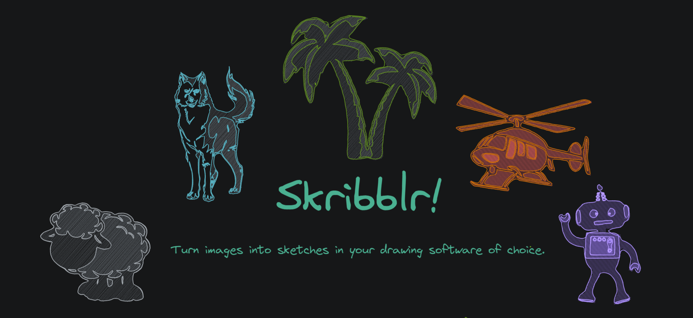
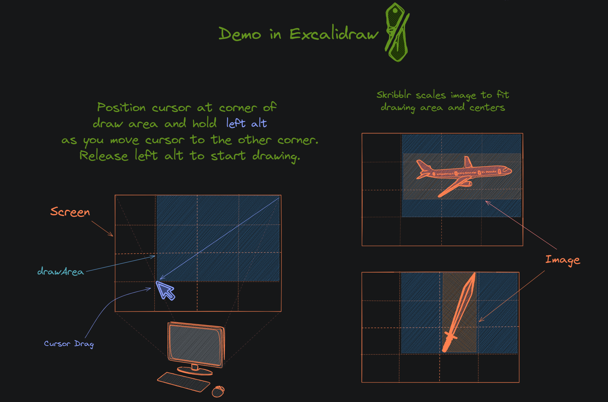
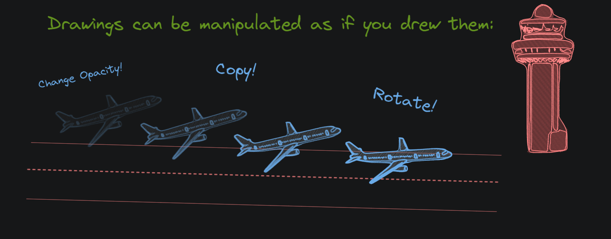

Skribblr is a tool for converting images into sketches that can be drawn in any program that uses the mouse to draw. Use it to fake your drawing ability or to spice up your diagrams without disrupting the style. 

**Warning: this tool moves your computers mouse directly. Use at your own risk.** 

## Requires
Python 3.8+

## Setup (Windows)
1. Clone this repo and `cd` into it.
2. (Optional) Set up a virtual env; run `python -m venv env`, then run `source env/Scripts/activate`
3. Run `pip install -r requirements.txt`
4. Run `python skribblr.py`

## How to use
After running the program, a GUI window will present itself. 

- prefix term: automatically preprended to the query term (e.g. "clipart", "cartoon", "svg")
- query term: used to download images from Bing images
- selection arrows: can be used to navigate between downloaded image contours
- start draw button: activates drawing mode
- threshold slider: can be used to manually adjust contours if desired

### Drawing Mode
Once drawing mode is activated, place cursor at the corner of the area you intend to draw in. Then hold **left alt** and move your cursor to the other corner of the drawing area. Release alt to begin drawing. Hold Escape to abort the current initiated drawing.

### [Excalidraw](https://excalidraw.com/) Demo

https://user-images.githubusercontent.com/11238512/190692842-8b046b8d-292e-4985-9ed9-d8477c60a80c.mp4

## Background
Originally I made this to *enhance* my drawings on skribbl.io (hence the name), but you can really use it in any program that does mouse drawing.

Websites I've tested:
- [excalidraw.com](https://excalidraw.com)
- [skribbl.io](https://skribbl.io)
- [sketchful.io](https://sketchful.io)
